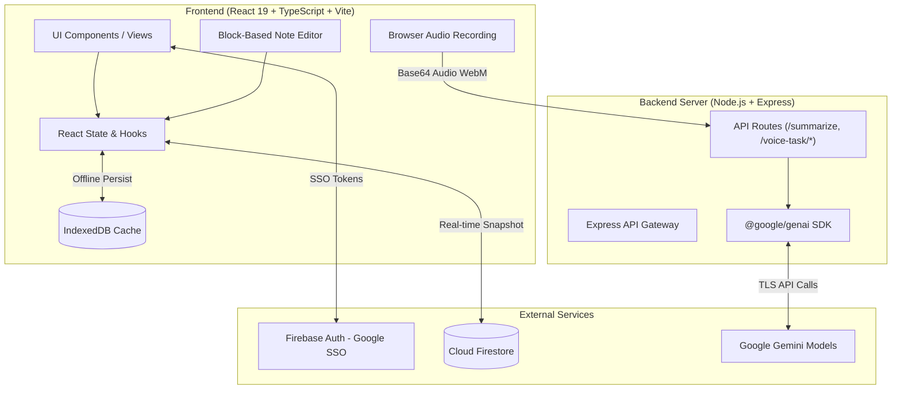

# NestNote - System Design & Architecture Document

## 1. Executive Summary & Overview

**NestNote** is an intelligent, task-centric workspace and block-based note-taking application. It bridges the gap between unstructured document editing (Notion-style block notes) and structured project management (calendars, progress tracking, task updates, status metrics, and AI voice capturing).

### 1.1 Core Mission
To provide individuals and teams with a unified, high-performance workspace where task capture, detailed note-taking, scheduling, and progress tracking seamlessly merge—boosted by server-side Generative AI processing.

### 1.2 Key Design Principles
- **Speed & Responsiveness**: Real-time multi-device synchronization via Cloud Firestore with offline fallback support via IndexedDB.
- **AI-First Productivity**: Seamless voice-to-task capturing, transcription, and context summarization powered by Google Gemini models.
- **Aesthetic Excellence**: Sleek dark mode visual hierarchy, smooth transitions, custom accent color themes, and micro-interactions.
- **Data Governance & Security**: Strict user-level security rules, auditing of security actions, complete data export compliance, and full account data purge capabilities.

---

## 2. System Architecture

NestNote uses a modern hybrid client-server architecture. The frontend React single-page application (SPA) communicates directly with Firebase (Firestore & Auth) for data persistence and authentication, while routing AI processing requests through a dedicated Node.js/Express backend server.



---

## 3. Comprehensive Feature Set

### 3.1 Notion-Style Block Editor
- **Dynamic Content Blocks**: Text, Heading 1, Heading 2, Heading 3, Bullet List, TODO Checkbox, Quote, Code Block (syntax highlighted), Callout (with custom emoji icon), and Image embed.
- **Keyboard Shortcuts & Drag-and-Drop**: Easy block creation, deletion, reordering, and type conversion.
- **Task Timeline Updates**: Append progress updates to tasks with status timestamps (`Not Started`, `In Progress`, `Hold`, `Completed`).
- **Cover Image & Icon Customization**: Assign Notion-style emojis and cover images to each note/task.
- **AI Task Summarization**: One-click AI summarization of task descriptions into crisp 8-10 word action summaries.

### 3.2 Voice Task Capturing & Audio Transcription
- **Native Browser Audio Capture**: Record voice notes directly in the client using the Web Audio MediaRecorder API.
- **AI Speech-to-Text**: Converts spoken WebM audio into verbatim text via `gemini-3.5-transcribe` (with `gemini-3.7-flash` fallback).
- **Intelligent Task Extraction**: Automatically parses voice transcripts into structured fields:
  - **Task Title**: Concise, actionable title (3-8 words).
  - **Task Description**: Remaining details, notes, or bullet points.
  - **Scheduled Date**: Resolves relative time phrases (e.g., "due tomorrow", "on Friday") to concrete `YYYY-MM-DD` dates relative to the reference date.

### 3.3 Interactive Task Management Views
- **Dashboard View**: Comprehensive metrics panel displaying completed vs pending tasks, priority distribution, overdue alerts, and quick completion toggles.
- **Calendar View**: Full-featured calendar supporting Month, Week, and Day views with task scheduling and date picker modals.
- **All Tasks View**: Data table view with multi-attribute filtering (workspace, status, priority, tags), search query matching, and batch operations (batch status update, batch archive, batch delete).
- **Command Palette (`Cmd+K` / `Ctrl+K`)**: Global search menu for navigating views, switching workspaces, creating notes, or opening tasks instantly.

### 3.4 Multi-Workspace & Visual Customization
- **Workspace Isolation**: Group tasks and notes under distinct workspace containers (e.g., "Personal Home", "Engineering", "Marketing").
- **Custom Accent Themes**: Personalize workspace UI with curated accent color palettes (`indigo`, `rose`, `emerald`, `amber`).
- **Dark / Light Mode**: High-contrast dark theme by default, styled using Tailwind CSS v4.

### 3.5 Security, Governance & Data Sovereignty
- **Google SSO Authentication**: Secure single sign-on with automatic profile synchronization.
- **Real-Time Security Audit Logs**: Track security actions (`LOGIN`, `CREATE_WORKSPACE`, `EXPORT_DATA`, `PURGE_ACCOUNT`, etc.).
- **Data Archive Export**: Export complete user profile, workspaces, notes, and audit logs into a standardized JSON file.
- **Data Purge**: One-click hard deletion of all user data from Cloud Firestore.

### 3.6 Diagnostic Test Bench
- **Developer Suite**: Dedicated test environment (`TestBenchView.tsx`) to validate Gemini API connections, measure model response latencies, run Firestore CRUD sanity checks, and verify voice transcription pipelines.

---

## 4. Data Architecture & Schema Specification

### 4.1 Data Schema Definitions

#### `Note` Entity
```typescript
interface Note {
  id: string;
  title: string;
  emoji: string;
  coverImage?: string;
  blocks: Block[];
  createdAt: number;
  updatedAt: number;
  scheduledDate?: string | null; // YYYY-MM-DD
  dueDate?: string | null;       // YYYY-MM-DD
  recurrence?: 'None' | 'Daily' | 'Weekly' | 'Monthly';
  remindersEnabled?: boolean;
  isFavorite?: boolean;
  isArchived?: boolean;
  status?: 'Not Started' | 'In Progress' | 'Hold' | 'Completed';
  priority?: 'Low' | 'Medium' | 'High';
  assignee?: string;
  assets?: { name: string; size: string; type: string }[];
  tags?: string[];
  updates?: TaskUpdate[];
  workspaceId?: string;
  userId?: string;
}
```

#### `Block` Entity
```typescript
type BlockType = 'text' | 'h1' | 'h2' | 'h3' | 'bullet' | 'todo' | 'quote' | 'code' | 'image' | 'callout';

interface Block {
  id: string;
  type: BlockType;
  content: string;
  properties?: {
    checked?: boolean;
    language?: string;
    caption?: string;
    emoji?: string;
  };
}
```

#### `Workspace` Entity
```typescript
interface Workspace {
  id: string;
  name: string;
  icon?: string;
  createdAt: number;
  accentColor?: string; // 'indigo' | 'rose' | 'emerald' | 'amber'
  userId?: string;
}
```

#### `User` Profile Entity
```typescript
interface User {
  uid: string;
  email: string;
  displayName?: string | null;
  photoURL?: string | null;
  createdAt: number;
  lastLoginAt: number;
}
```

#### `AuditLogEntry` Entity
```typescript
interface AuditLogEntry {
  id: string;
  userId: string;
  action: 'LOGIN' | 'CREATE_WORKSPACE' | 'DELETE_WORKSPACE' | 'UPDATE_PROFILE' | 'EXPORT_DATA' | 'PURGE_ACCOUNT' | 'ARCHIVE_TASK' | 'RESTORE_TASK' | 'CREATE_TASK' | 'DELETE_TASK';
  details: string;
  timestamp: number;
}
```

---

## 5. Security & Access Control

### 5.1 Firestore Security Rules
All Firestore collections (`users`, `workspaces`, `notes`, `auditLogs`) enforce document-level ownership isolation via `firestore.rules`:

```cel
rules_version = '2';
service cloud.firestore {
  match /databases/{database}/documents {
    function isAuthenticated() {
      return request.auth != null;
    }
    function isOwner(userId) {
      return isAuthenticated() && request.auth.uid == userId;
    }

    match /users/{userId} {
      allow read, write: if isOwner(userId);
    }
    match /workspaces/{workspaceId} {
      allow create: if isAuthenticated() && request.resource.data.userId == request.auth.uid;
      allow read, update, delete: if isAuthenticated() && resource.data.userId == request.auth.uid;
    }
    match /notes/{noteId} {
      allow create: if isAuthenticated() && request.resource.data.userId == request.auth.uid;
      allow read, update, delete: if isAuthenticated() && resource.data.userId == request.auth.uid;
    }
    match /auditLogs/{logId} {
      allow create: if isAuthenticated() && request.resource.data.userId == request.auth.uid;
      allow read, delete: if isAuthenticated() && resource.data.userId == request.auth.uid;
    }
    match /{document=**} {
      allow read, write: if false;
    }
  }
}
```

### 5.2 API Key Protection
- The Google Gemini API key (`GEMINI_API_KEY`) is stored strictly in server environment variables and never exposed to the client bundle.
- Audio payloads and prompt requests are validated and processed server-side in `server.ts`.

---

## 6. Backend API Specification

| Endpoint | Method | Input Payload | Output Payload | Description |
| :--- | :--- | :--- | :--- | :--- |
| `/api/summarize` | `POST` | `{ description: string }` | `{ summary: string }` | Generates a 8-10 word action summary from description text. |
| `/api/voice-task/analyze-text` | `POST` | `{ transcript: string, currentDate: string }` | `{ title, description, scheduledDate, rawTranscript }` | Parses text transcripts into structured task parameters. |
| `/api/voice-task/transcribe-audio` | `POST` | `{ audioBase64: string, mimeType: string, currentDate: string }` | `{ title, description, scheduledDate, rawTranscript }` | Transcribes WebM audio recording and parses into structured task parameters. |

---

## 7. UI/UX Design System

- **Color System**: Dark-first interface featuring HSL tailored colors (`#0f172a`, `#1e293b`), glassmorphism cards, and accent highlights.
- **Typography**: Clean sans-serif system fonts optimized for legibility across task tables and editor blocks.
- **Iconography**: Lucide React iconography set for consistent, modern visual language.
- **Animations**: Framer Motion (`motion`) transitions for modal entrances, view switching, and toast alerts.

---

## 8. Technology Stack Details

- **Frontend**: React 19, TypeScript, Vite 6, Tailwind CSS v4
- **State & Data Handling**: React Hooks, Cloud Firestore `onSnapshot` real-time subscriptions, IndexedDB local persistence
- **Backend & Tooling**: Express 4, `tsx`, `@google/genai`
- **Icons & Motion**: Lucide React, Framer Motion v12
